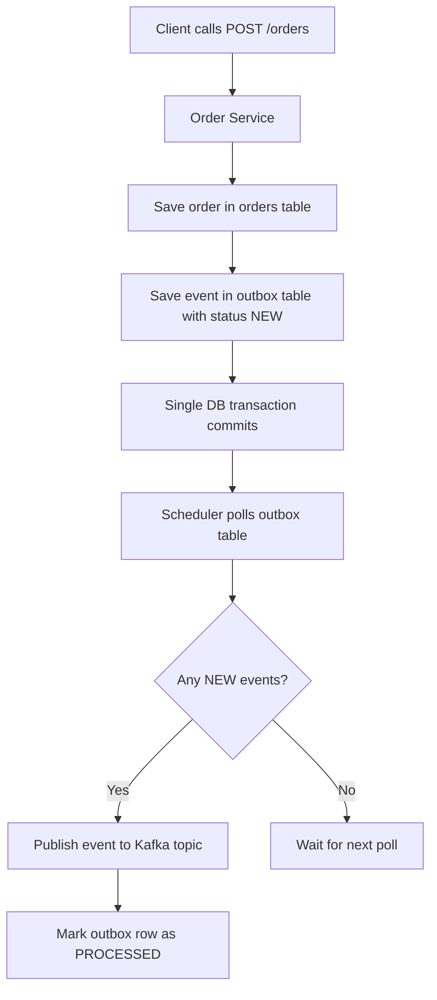

# Understanding the Outbox Pattern in Spring Boot (With Practical Example)

In distributed systems, generally one service often does multiple things together:

- save business data in database
- publish an event to Kafka

At first, this looks simple.

But if this is not handled carefully, we can get data inconsistency.

In this article, we will understand:

- what problem we face when doing DB + Kafka together
- why this problem happens
- how Outbox Pattern solves it
- practical Spring Boot implementation (with code)

---

## The Problem

Let us take a simple example.

We have an **Order Service**.

When an order is created, we want to:

1. save order in DB
2. publish `ORDER_CREATED` event to Kafka

A direct implementation usually looks like this:

```java
public void createOrder(CreateOrderRequest request) {
    Order order = orderRepository.save(new Order(request.productName(), request.quantity()));
    kafkaTemplate.send("order-events", order);
}
```

Looks fine right? But there are failure gaps.

---

## What Can Go Wrong?

### Case 1: DB success, Kafka failure

- order row is committed in DB
- Kafka publish fails

Now order exists, but downstream services never get event.

### Case 2: Event publish starts, but app fails before DB commit completes

- event flow and DB flow are not truly atomic
- system can move into inconsistent state

In short: doing DB + message publish as separate operations is risky.

---

## Why Not Use Distributed Transactions (2PC)?

A common question here is:

> If we want DB write and Kafka publish to behave like one unit, why not just use one transaction across both?

This is where distributed transaction comes in.

A distributed transaction tries to make multiple different systems commit together.

For example:
- database
- message broker
- another external system

One common approach is 2PC (Two-Phase Commit).

In simple terms, how 2PC works
It happens in 2 phases:

**Phase 1: Prepare**

A coordinator asks all participating systems:
> Are you ready to commit?

**Phase 2: Commit**

If all participants say yes, coordinator sends final commit command.
Then all systems commit.

If even one participant fails, coordinator tells everyone to roll back.

Although this sounds good, in practice it has problems:
- complex to implement
- expensive and it can reduce performance
- avoided in most microservice architectures

So we need a simpler pattern.

---

## Outbox Pattern

Instead of publishing event directly to Kafka inside business flow:

- save order
- save event in **outbox table**
- both in same DB transaction

Then a separate publisher reads outbox and pushes to Kafka.

This gives us reliable handoff.

---

## High-Level Flow

1. Client calls `POST /orders`
2. Service saves order in `orders` table
3. Service saves event in `outbox` table with status `NEW`
4. Transaction commits
5. Scheduler reads `NEW` events from outbox
6. Publishes each event to Kafka
7. Marks event as `PROCESSED`



---

## Implementation From This Project

### 1) Order + Outbox write in one transaction

`OrderService#createOrder`:

```java
@Transactional
public Order createOrder(CreateOrderRequest request) {
    Order order = orderRepository.save(new Order(request.productName(), request.quantity()));

    String payload = toJson(order);
    OutboxEvent outboxEvent = new OutboxEvent(order.getId(), "ORDER_CREATED", payload, OutboxStatus.NEW);
    outboxEventRepository.save(outboxEvent);

    return order;
}
```

Key point:

- order row and outbox row are inserted in same transaction

If transaction fails, both fail.

---

### 2) Outbox event model

`OutboxEvent`:

```java
@Entity
@Table(name = "outbox")
public class OutboxEvent {

    @Id
    @GeneratedValue(strategy = GenerationType.IDENTITY)
    private Long id;

    @Column(name = "aggregate_id", nullable = false)
    private Long aggregateId;

    @Column(name = "event_type", nullable = false)
    private String eventType;

    @Lob
    @Column(nullable = false)
    private String payload;

    @Enumerated(EnumType.STRING)
    @Column(nullable = false)
    private OutboxStatus status;

    @Column(name = "created_at", nullable = false)
    private LocalDateTime createdAt;
}
```

Status enum:

```java
public enum OutboxStatus {
    NEW,
    PROCESSED
}
```

---

### 3) Poll and publish pending events

`OutboxPublisher#publishNewEvents`:

```java
@Scheduled(fixedDelayString = "${outbox.publisher.delay-ms:5000}")
@Transactional
public void publishNewEvents() {
    List<OutboxEvent> events = outboxEventRepository.findTop20ByStatusOrderByCreatedAtAsc(OutboxStatus.NEW);

    for (OutboxEvent event : events) {
        try {
            kafkaTemplate.send("order-events", String.valueOf(event.getAggregateId()), event.getPayload()).get();
            event.markProcessed();
        } catch (Exception e) {
            log.error("Failed to publish outbox event: outboxId={}", event.getId(), e);
        }
    }
}
```

Repository method:

```java
List<OutboxEvent> findTop20ByStatusOrderByCreatedAtAsc(OutboxStatus status);
```

Why this is good:

- publishes in created order
- processes in small batch
- only `NEW` records are picked

---

## What This Solves

Outbox pattern solves the biggest issue:

- business data and event intent are stored atomically

So we avoid "order committed but event completely lost" case.

---

## What Is Still Required for Production

Outbox improves reliability, but we still need:

- retry/backoff strategy for publish failures
- dead-letter handling
- idempotent consumers
- monitoring for stuck `NEW` rows

Important edge case:

If Kafka publish succeeds but app crashes before marking `PROCESSED`, event can be published again later.

That is why consumer idempotency is very important.

---

## Conclusion

If your service writes to DB and also publishes events, Outbox Pattern is one of the safest practical approaches.

It keeps your system consistent without distributed transaction complexity.

Simple summary:

- write business row + outbox row together
- publish asynchronously from outbox
- mark processed
- design consumers to handle duplicates safely

That gives a robust and production-friendly event flow.
